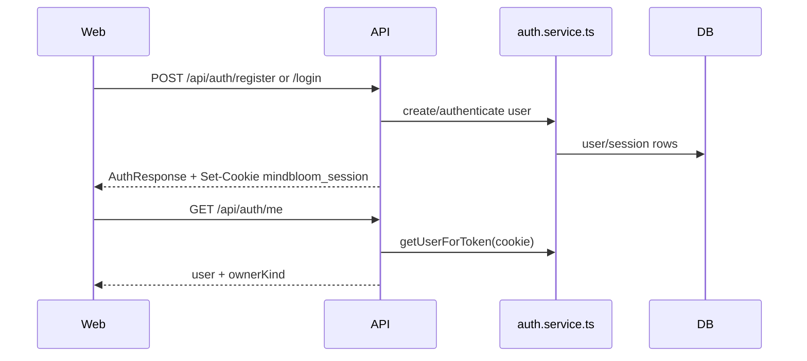

# Account, Auth, Demo, and Settings

This ownership area covers identity, HTTP-only session cookies, owner-scope
resolution, frontend auth state, demo-mode switching, localStorage demo data,
settings, and calendar-adjacent behavior.

## Primary Files and Folders

| Path | Role |
| --- | --- |
| `apps/api/src/routes/auth.routes.ts` | Register, login, logout, current user. |
| `apps/api/src/services/auth.service.ts` | User/session persistence, password hashing, session hashing, dev seeding. |
| `apps/api/src/http/cookies.ts` | Cookie parsing. |
| `apps/api/src/http/middleware/requireAuth.ts` | Requires an authenticated session. |
| `apps/api/src/http/middleware/requireOwner.ts` | Resolves owner scope and validates owned entries. |
| `apps/web/src/auth/AuthContext.tsx` | Frontend auth state and mode switching. |
| `apps/web/src/lib/api.ts` | Auth API methods and demo/authenticated routing. |
| `apps/web/src/lib/demoStore.ts` | Browser-local demo data store. |
| `apps/web/src/pages/AuthPage.tsx` | Login/register page. |
| `apps/web/src/pages/SettingsPage.tsx` | Settings UI. |
| `apps/web/src/pages/CalendarPage.tsx` | Calendar activity UI. |
| `apps/api/src/routes/settings.routes.ts` | Settings and calendar activity API. |

## Authentication Flow

The session cookie is HTTP-only and named `mindbloom_session`. In production,
the cookie adds `Secure`. Raw session secrets are not stored directly; the
service stores hashed session tokens.

## Auth Route Methods

`auth.routes.ts` contains:

| Method | Purpose |
| --- | --- |
| `sessionCookie(token, expiresAt)` | Builds the Set-Cookie value for a valid session. |
| `clearSessionCookie()` | Builds the expired cookie used during logout. |
| `POST /register` | Validates email/password/display name, creates user, creates session, sets cookie. |
| `POST /login` | Validates credentials, creates session, sets cookie. |
| `POST /logout` | Revokes current token and clears cookie. |
| `GET /me` | Returns current user or `null`, plus `ownerKind` of `authenticated` or `demo`. |

## Auth Service Responsibilities

`auth.service.ts` owns:

- Creating users.
- Hashing passwords.
- Authenticating email/password.
- Creating sessions.
- Hashing session tokens.
- Looking up users by session cookie token.
- Revoking sessions.
- Seeding development users outside production.

Developers should treat password/session helpers as security-sensitive. Avoid
logging raw tokens or passwords.

## Owner Scope

Most journal data is scoped by:

- `ownerId`
- `ownerKind`, either `authenticated` or `demo`

`requireOwner.ts` is the API gatekeeper for owner-scoped data. It reads the
session cookie, resolves the current user, and provides helper behavior such as
owned-entry checks. Authenticated API calls should not trust client-supplied
owner IDs.

## Frontend Auth State

`AuthContext.tsx` owns:

- Loading current auth with `getCurrentAuth()`.
- Registering with `registerUser()`.
- Logging in with `loginUser()`.
- Logging out with `logoutUser()`.
- Exposing the current user and owner kind to the app.
- Calling `setApiOwnerKind()` so `api.ts` knows whether to use demo mode or the
  authenticated API.

If `GET /api/auth/me` returns no user, the frontend enters demo mode.

## Demo Mode

Demo mode is implemented in the browser, not the API. The main pieces are:

- `api.ts`: checks `apiOwnerKind` through `isDemoMode()`.
- `demoStore.ts`: implements many of the same operations as the API.
- `localStorage` key: `mindbloom:demo:data:v1`.

Demo data includes entries, drafts/documents, messages, notes, grafts,
reflections, share-link metadata, settings, and local map data. It is
device/browser-specific and disappears if site storage is cleared.

## Demo Store Method Groups

`demoStore` mirrors API behavior for:

- Entry list/create/update/delete.
- Entry document load/save/ingest.
- Entry messages and Bloom-like local fallback behavior.
- Notes CRUD.
- Entry graft metadata.
- Entry reflections.
- Settings and calendar activity.

The important rule is shape compatibility: frontend components should receive
the same shared response types whether they are in demo or authenticated mode.

## Settings and Calendar

`settings.routes.ts` owns backend settings:

- `GET /api/settings`
- `PATCH /api/settings`
- `GET /api/calendar/activity`

`SettingsPage.tsx` lets the user control calendar visibility, calendar mode, and
streak behavior. `CalendarPage.tsx` reads calendar activity and settings. In
demo mode these calls route to `demoStore`; in authenticated mode they call the
API.

Settings type:

- `calendarEnabled`
- `calendarMode`: `gentle` or `habit`
- `streaksEnabled`
- `updatedAt`

## Shared Code Used

This area uses these shared types heavily:

- `AuthUser`, `RegisterRequest`, `LoginRequest`, `AuthResponse`,
  `AuthMeResponse`.
- `EntryOwnerKind`.
- `UserSettings`, `UpdateSettingsRequest`, `SettingsResponse`.
- `CalendarActivityDay`, `CalendarActivityResponse`.

## Environment Variables

The auth/settings API indirectly depends on:

- `DATABASE_URL` for user/session/settings persistence.
- `CORS_ORIGIN` so browser requests can include credentials.
- `NODE_ENV` for production cookie security behavior.

Web auth calls use `VITE_API_BASE_URL` through `api.ts`.

## Things To Be Careful About

- Do not expose raw session tokens to client JavaScript.
- Keep cookie credentials enabled on browser fetch calls that need auth.
- Keep demo and authenticated response shapes aligned.
- Owner checks must happen before reading or mutating user data.
- Public share routes are token-based; authenticated share management is
  owner-based.

