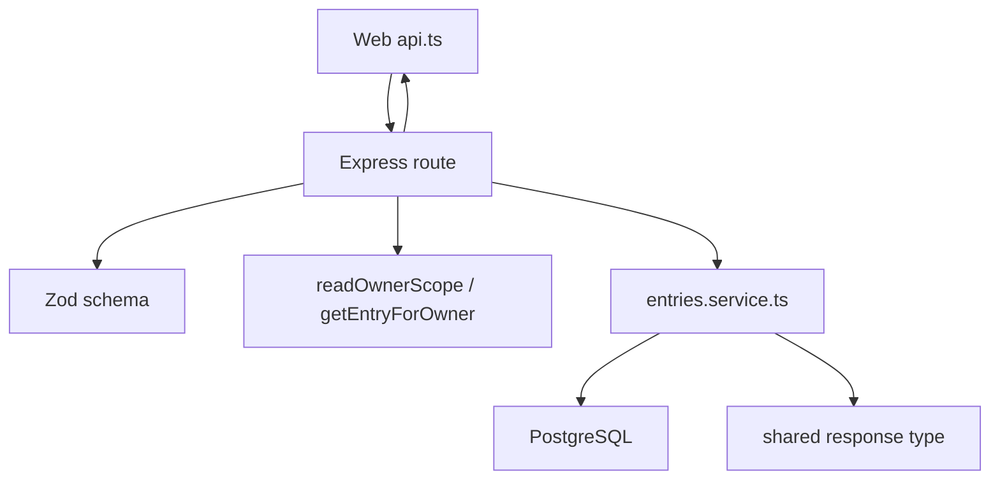

# API and Journal Data

This ownership area covers authenticated backend routes, request validation,
service/repository behavior, database-backed journal data, notes, reflections,
share links, settings, and the shared API contracts.

## Primary Files and Folders

| Path | Role |
| --- | --- |
| `apps/api/src/app.ts` | Mounts all API routers and shared middleware. |
| `apps/api/src/routes` | Express route handlers and request validation. |
| `apps/api/src/services/entries.service.ts` | Main app data store and mapper for entries, documents, messages, notes, grafts, reflections, share links, settings, calendar activity. |
| `apps/api/src/repositories` | Focused SQL repository helpers. |
| `apps/api/src/schemas` | Reusable Zod schemas. |
| `apps/api/src/db/schema.ts` | MindBloom table definitions and row interfaces. |
| `apps/api/src/config/db.ts` | Query helper, transaction helper, schema initialization. |
| `packages/shared/src/index.ts` | API request/response/domain contracts. |

## Route Layer Responsibilities

Routes should:

- Parse path/query/body input.
- Validate with Zod.
- Resolve owner scope where needed.
- Call service methods.
- Convert errors to `ApiError` when the client needs a clear status/message.
- Return typed responses matching `@mindbloom/shared`.
- Handle special transport behavior such as SSE streaming.

Routes should not contain raw SQL.

## Service and Repository Responsibilities

`entries.service.ts` currently centralizes much of the app store behavior. It:

- Defines owner-aware input types.
- Converts DB rows to shared response types.
- Normalizes tags and default settings.
- Creates IDs and timestamps.
- Groups entries/notes by date.
- Implements CRUD-like methods for multiple data domains.

Repositories under `apps/api/src/repositories` are smaller SQL-focused modules.
As the codebase grows, moving more SQL from the central service into
repositories would make ownership clearer.

## Main Data Flow

## Entry APIs

`entries.routes.ts` owns a large surface:

- `GET /api/entries`: list entries and groups.
- `POST /api/entries`: create entry.
- `GET /api/entries/:entryId`: get one entry.
- `PATCH /api/entries/:entryId`: update title/tags/status/future-context.
- `DELETE /api/entries/:entryId`: delete entry.
- Document routes for load/save/ingest.
- Message routes for load/create/stream.
- Snapshot routes for entry graph state.
- Graft routes for brought-in context.
- Entry reflection routes.

Important helper methods in the route:

| Method | Purpose |
| --- | --- |
| `toTopicPills()` | Converts active graph nodes into frontend topic pills. |
| `maxTopicsForText()` | Applies topic caps for short entries. |
| `limitTopicPillsForText()` | Prevents short drafts from showing too many topics. |
| `limitSnapshotForText()` | Keeps snapshots proportionate to short text. |
| `isWithinDateRange()` | Filters source entries for grafting. |
| `getOwnedSourceEntries()` | Resolves eligible source entries for graft operations. |
| `writeStreamEvent()` | Writes Server-Sent Events chunks. |
| `buildBloomWritingContext()` | Builds context for Bloom message streaming. |

## Entry Store Methods

Important `entryStore` responsibilities include:

| Method family | Used for |
| --- | --- |
| Entry methods | Create, list, get, update, and delete `JournalEntry` records. |
| Document methods | Upsert and read `EntryDocument`, manage version and `lastIngestedVersion`. |
| Message methods | Add and list `EntryMessage` rows. |
| Graft methods | Save and list `EntryGraft` provenance. |
| Note methods | Create, list, update, delete notes and group them by day. |
| Reflection methods | Create/list/get `EntryReflection` rows with card JSON and graph snapshots. |
| Share-link methods | Create/list/get/revoke links and find public links by token. |
| Settings methods | Get/update owner settings and compute calendar activity. |

Helper methods:

- `getMemoSessionIdForEntry(entryId)` creates the stable memo session ID.
- `normalizeEntryTags()` lowercases, trims, deduplicates, and caps tags.
- `createDefaultSettings()` provides settings defaults for new owner scopes.
- `getMoodColor()` maps mood labels to simple color names for calendar activity.
- `toEntry()`, `toDocument()`, `toMessage()`, and similar mappers convert DB
  rows to shared API shapes.

## Notes APIs

`notes.routes.ts` owns note CRUD:

- `POST /api/notes`: create note.
- `GET /api/notes`: list notes and day groups.
- `GET /api/notes/:noteId`: get one owned note.
- `PATCH /api/notes/:noteId`: update title/body/color/pinned.
- `DELETE /api/notes/:noteId`: delete note.

`getNoteForOwner()` ensures a note belongs to the current owner before update or
delete. When `entryId` is supplied on create, the route verifies the entry is
owned by the same user.

## Settings and Calendar APIs

`settings.routes.ts` owns:

- `GET /api/settings`
- `PATCH /api/settings`
- `GET /api/calendar/activity`

Settings are owner-scoped and stored in `mindbloom_user_settings`. Calendar
activity is computed from entries, notes, and reflections plus settings.

## Reflection Share APIs

`share.routes.ts` owns:

- `POST /api/reflections/:reflectionId/share-links`
- `GET /api/reflections/:reflectionId/share-links`
- `DELETE /api/share-links/:shareLinkId`
- `GET /api/share/:token`

Important methods:

| Method | Purpose |
| --- | --- |
| `getReflectionForOwner()` | Ensures only authenticated owners can create/list/revoke share links for their reflection. |
| `isExpired()` | Checks token expiration. |
| `parseReflectionId()`, `parseShareLinkId()`, `parseToken()` | Validate route params. |

Public share reads only return selected cards from a valid, unrevoked,
unexpired token.

## Database Tables

The app schema owns:

- `mindbloom_users`
- `mindbloom_auth_sessions`
- `mindbloom_user_settings`
- `mindbloom_journal_entries`
- `mindbloom_entry_documents`
- `mindbloom_entry_messages`
- `mindbloom_entry_grafts`
- `mindbloom_notes`
- `mindbloom_entry_reflections`
- `mindbloom_reflection_share_links`

`initializeDb()` runs `createAppSchemaSql` at API startup and during API tests.

## Shared Code Used

This area imports many request/response types from `@mindbloom/shared`. Any API
shape change must be mirrored in:

- API route response construction.
- `entryStore` mappers.
- Web `api.ts`.
- Demo store behavior.
- Tests.

## Things To Be Careful About

- Always resolve owner scope before reading or mutating owner-scoped data.
- Keep API and demo responses shape-compatible.
- Use parameterized SQL only; table names should come from fixed constants.
- Preserve `lastIngestedVersion` semantics.
- Share-link public responses should stay narrow and token-scoped.

