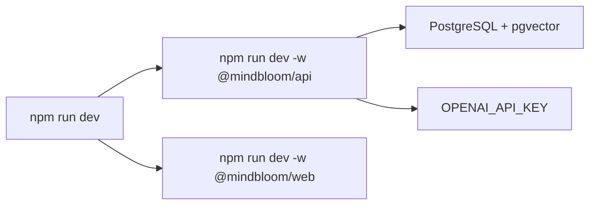

# Infrastructure, QA, and Release

This ownership area covers workspace scripts, local development, builds,
typechecking, tests, end-to-end checks, deployment config, environment handling,
and codebase boundary checks.

## Primary Files and Folders

| Path | Role |
| --- | --- |
| `package.json` | Root workspace scripts and shared dev dependencies. |
| `apps/api/package.json` | API scripts, dependencies, test command. |
| `apps/web/package.json` | Web scripts, dependencies, test command. |
| `packages/shared/package.json` | Shared package scripts. |
| `tsconfig.json` | Root TypeScript project references. |
| `apps/*/tsconfig*.json` | Per-package TypeScript configs. |
| `playwright.config.ts` | E2E configuration. |
| `e2e` | Playwright tests. |
| `scripts/check-boundaries.mjs` | Static repository boundary rules. |
| `render.yaml` | API deployment config. |
| `vercel.json` | Web deployment config. |
| `apps/api/src/server.ts` | API runtime startup/shutdown. |
| `apps/api/src/config/env.ts` | API environment validation. |
| `apps/api/src/config/db.ts` | DB pool and schema initialization. |
| `apps/api/tests/setup.ts` | API test environment and DB setup. |
| `apps/web/src/test/setup.ts` | Web test browser mocks and cleanup. |

## Workspace Commands

| Command | Purpose |
| --- | --- |
| `npm run dev` | Starts API and web together with `concurrently`. |
| `npm run dev:api` | Starts only the API watcher. |
| `npm run dev:web` | Starts only Vite. |
| `npm run build` | Builds all workspaces with build scripts. |
| `npm run build:api` | Builds API only. |
| `npm run build:web` | Builds web only. |
| `npm run typecheck` | TypeScript project build/typecheck. |
| `npm run lint` | Workspace lint scripts; currently mostly TypeScript no-emit checks. |
| `npm test` | Runs tests in workspaces. |
| `npm run test:api` | Runs API Vitest suite. |
| `npm run test:web` | Runs web Vitest suite. |
| `npm run test:e2e` | Runs Playwright tests. |
| `npm run check:boundaries` | Runs static boundary rules. |
| `npm run memo:init` | Initializes memo-grafter schema metadata. |
| `npm run memo:migrate` | Applies memo-grafter migrations. |
| `npm run memo:studio` | Opens memo-grafter Studio for graph inspection. |
| `npm run start:api` | Runs built API server. |

## Local Dev Startup

Before full authenticated local development:

1. Install dependencies with `npm install`.
2. Create `apps/api/.env` and `apps/web/.env`.
3. Ensure Postgres has `pgvector`.
4. Run `npm run memo:init` and `npm run memo:migrate`.
5. Run `npm run dev`.

Demo mode can exercise much of the frontend without a database, but
authenticated flows need the API and DB.

## API Startup and Shutdown

`server.ts` does the runtime work:

- Initializes the MindBloom app schema with `initializeDb()`.
- Seeds development users outside production.
- Starts the Express server on `PORT` or `API_PORT`.
- Handles concise occupied-port errors.
- Shuts down memo-grafter agents and the DB pool during graceful shutdown.

## Boundary Checks

`scripts/check-boundaries.mjs` scans source files under:

- `apps/api/src`
- `apps/web/src`
- `packages/shared/src`

It currently checks:

- Frontend/shared code must not import `memo-grafter`.
- Forbidden Anthropic/Claude references are not present.

Add future architectural rules here when they can be checked statically.

## Deployment

| Surface | Config | Notes |
| --- | --- | --- |
| API | `render.yaml` | Runs the Express API. Needs API env vars. |
| Web | `vercel.json` | Serves the Vite build. Needs `VITE_API_BASE_URL`. |
| Database | external Postgres/Neon | Needs `pgvector`; used by app tables and memo-grafter tables. |
| Memo-grafter | CLI scripts | Migrations must run against target database before graph runtime use. |

## Environment Variables

API validation is in `apps/api/src/config/env.ts`.

| Variable | Required in real API runtime | Purpose |
| --- | --- | --- |
| `DATABASE_URL` | Yes | Postgres connection. |
| `OPENAI_API_KEY` | Yes | OpenAI calls. |
| `MEMO_GRAFTER_EMBEDDING_MODEL` | No | Optional embedding override. |
| `API_PORT` | No | Local port, default `4000`. |
| `PORT` | No | Hosting provider port. |
| `CORS_ORIGIN` | No | Defaults to `http://localhost:5173`. |
| `NODE_ENV` | No | Defaults to `development`; affects cookie security and seeding. |

Web uses:

| Variable | Required | Purpose |
| --- | --- | --- |
| `VITE_API_BASE_URL` | No for default local API | Browser API base URL. Defaults to `http://localhost:4000`. |

## Test Infrastructure

See `testing-guide.md` for test-by-test detail. Infrastructure owners should
keep these setup files healthy:

- `apps/api/tests/setup.ts`
- `apps/web/src/test/setup.ts`
- `playwright.config.ts`

API tests use environment variables and a real disposable test database. Web
unit tests use jsdom and mocked fetch/local browser APIs. E2E tests run through
Playwright.

## Things To Be Careful About

- Do not run API tests against a non-test database.
- Keep generated build output ignored.
- Keep local-only knowledge docs ignored through `knowledge/`.
- If scripts change, update this document and `README.md`.
- If deployment env vars change, update Render/Vercel documentation.

