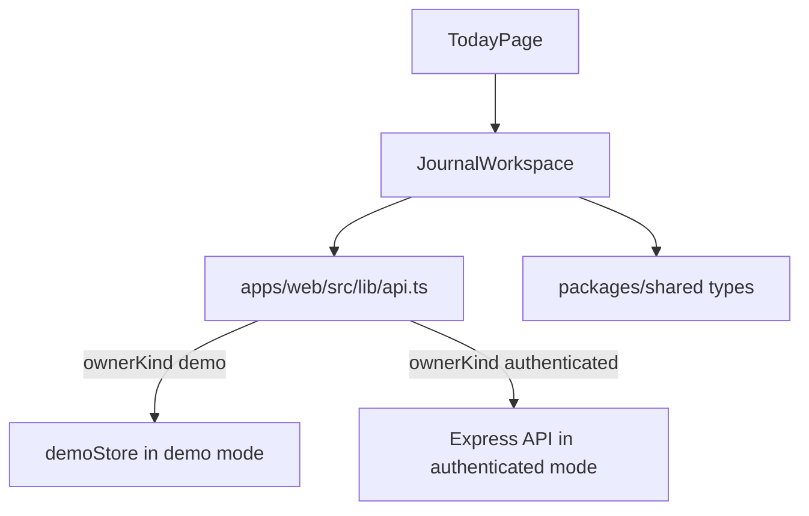

# Journal Product Experience

This ownership area covers the primary writing experience: entries, editor,
entry sidebar, Bloom panel interactions, entry-local map/reflect views, notes
from selections, and reflection sharing controls inside the workspace.

## Primary Files and Folders

| Path | Role |
| --- | --- |
| `apps/web/src/components/journal/JournalWorkspace.tsx` | Main workspace. This is the largest frontend file and contains most journal UX state and child components. |
| `apps/web/src/pages/TodayPage.tsx` | Route-level wrapper for the workspace. |
| `apps/web/src/components/chat` | Chat/Bloom support components used by journal-style experiences. |
| `apps/web/src/lib/api.ts` | API client methods used by the workspace. Routes to `demoStore` in demo mode. |
| `apps/web/src/lib/demoStore.ts` | Local demo implementation of the same journal operations. |
| `apps/web/src/components/map/MapViews.tsx` | Embedded map view used inside the workspace. |
| `packages/shared/src/index.ts` | Entry, document, message, graph, note, reflection, and share-link types. |

## What This Area Owns

- Creating, selecting, renaming, deleting, and grouping journal entries.
- Loading and saving entry documents.
- Triggering semantic ingestion after writing changes.
- Showing and resizing the Bloom side panel.
- Sending Bloom messages with draft, selected text, tags, and brought-in context.
- Creating notes from selected writing, Bloom messages, or reflection cards.
- Viewing entry graph/map snapshots from within the workspace.
- Creating entry reflection cards and share links.

## Main Flow

The workspace should not know whether the user is in demo or authenticated mode.
It calls typed functions from `api.ts`; `api.ts` chooses network or local demo
storage.

## Important Workspace Helpers and Concepts

`suggestedTags` defines the first-class entry tags shown to the user:
`journal`, `idea`, and `brainstorm`.

`WorkspaceView` controls the center workspace mode:

- `editor`: main writing surface.
- `map`: embedded graph/map view.
- `reflect`: entry reflection surface.

`getBloomPanelMaxWidth()` and `clampBloomPanelWidth()` keep the Bloom side panel
within usable bounds based on window width. This matters because the editor and
panel share horizontal space.

`isWorkspaceView()` validates stored or parsed view values before applying them.

`formatDay()` converts entry group dates into display text, using `Today` for
the current date.

`upsertEntryGroup()` updates grouped entry lists after create/update operations.
It removes stale copies of an entry, inserts the latest entry into the correct
date group, and sorts groups by date.

`entryIcon()` chooses a visual icon from entry tags.

`formatTags()` converts the tag array into a compact display string.

`shareUrl()` builds a public share URL from a reflection share token.

## Major UI Sub-areas in `JournalWorkspace.tsx`

### Entry Sidebar

The sidebar owns:

- Entry list grouped by day.
- Selecting an entry.
- Hover/prefetch behavior.
- Creating a new entry.
- Deleting an entry.
- Inline rename state.
- Mobile open/close behavior.

It calls callbacks supplied by the main workspace. The main workspace keeps the
server/demo state synchronized.

### Editor Surface

The editor owns:

- Current document content.
- Save/autosave behavior.
- Dirty/loading/error state.
- Selection tracking for note creation.
- Entry title/tags/status interactions.

Document saving uses `saveEntryDocument(entryId, { content })`. Semantic graph
refresh uses `ingestEntryDocument(entryId, ...)`. These are separate concerns:
save persists text; ingest updates memory topics.

### Bloom Panel

The Bloom panel owns:

- Message list for the selected entry.
- Current prompt input.
- Streaming token display.
- User-message echo.
- Final assistant-message handling.
- Topic pill updates after streaming completes.

The panel usually calls `streamEntryMessage()`. That function sends the writer's
request and can include current draft text, selected text, tags, and brought-in
context labels.

### Map View

The workspace calls `getEntrySnapshot()` or uses existing graph data and renders
`MapViews`. This keeps map rendering reusable between the workspace and the full
Map page.

### Reflect and Share

Entry reflection creation calls `createEntryReflection()`. Share link controls
call:

- `listReflectionShareLinks()`
- `createReflectionShareLink()`
- `revokeReflectionShareLink()`

Authenticated sharing is enforced by the API. Demo mode can provide local
reflection behavior, but public share-link behavior is fundamentally an
authenticated/server concept.

## API Client Methods Used Here

| Method | Used for |
| --- | --- |
| `listEntries()` | Load grouped and flat entry lists. |
| `createEntry()` | Create a new journal entry. |
| `updateEntry()` | Rename, retag, complete, or update future-context settings. |
| `deleteEntry()` | Delete an entry and related child data. |
| `getEntryDocument()` | Load saved text for an entry. |
| `saveEntryDocument()` | Persist current writing. |
| `ingestEntryDocument()` | Update memory graph and topic pills from writing. |
| `getEntrySnapshot()` | Load graph snapshot for one entry. |
| `listEntryMessages()` | Load Bloom message history. |
| `streamEntryMessage()` | Send a Bloom request and receive SSE events. |
| `createNote()` | Save a note from selection/message/reflection/blank source. |
| `listEntryReflections()` | Load existing entry reflection cards. |
| `createEntryReflection()` | Generate a new entry reflection. |
| `listReflectionShareLinks()` | Show share links for a reflection. |
| `createReflectionShareLink()` | Create a public share token for selected cards. |
| `revokeReflectionShareLink()` | Disable a share link. |

## Shared Code Used

- `EntryDayGroup`, `JournalEntry`, `EntryDocument`, `EntryMessage`,
  `GraphSnapshotResponse`, `EntryReflection`, `ReflectionCard`, and
  `ReflectionShareLink` from `@mindbloom/shared`.
- Map rendering from `components/map`.
- Icons from `lucide-react`.
- React state/effect/ref hooks.

## Common Changes

- Adding an entry metadata field requires updates in shared types, API
  validation, API persistence, `demoStore`, and workspace UI.
- Changing Bloom message context requires matching changes to
  `streamEntryMessage()` payload and `entries.routes.ts`.
- Changing reflection cards requires updates in the API memory logic and the
  workspace rendering/share selection behavior.

## Things To Be Careful About

- Keep demo and authenticated behavior aligned through `api.ts`.
- Do not bypass owner-aware API methods from UI code.
- Avoid adding more unrelated responsibilities to `JournalWorkspace.tsx`; it is
  already the main frontend hotspot.
- Preserve document save vs document ingest separation.
- Streaming UI should handle partial output, final output, and errors.

