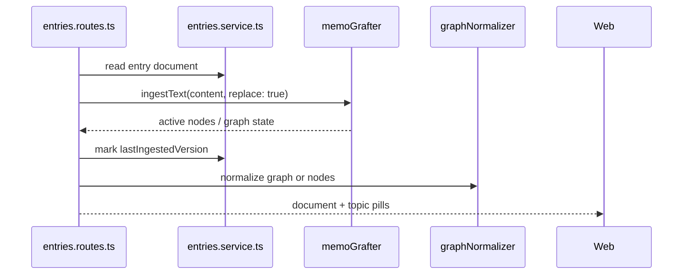

# Memory, AI, and Graph Intelligence

This ownership area covers memo-grafter integration, graph snapshots, recall,
grafting, Bloom insights, entry reflection cards, weekly reflection, OpenAI
adapters, and prompt behavior.

## Primary Files and Folders

| Path | Role |
| --- | --- |
| `apps/api/src/memo-grafter/memoGrafter.ts` | Creates/caches memo-grafter agents, streams output, shuts agents down. |
| `apps/api/src/memo-grafter/openAiAdapters.ts` | OpenAI adapter integration for memo-grafter. |
| `apps/api/src/memo-grafter/mg.config.ts` | Memo-grafter CLI and Studio configuration. |
| `apps/api/src/memo-grafter/mg-schema.ts` | Generated/reference schema metadata for memo-grafter. |
| `apps/api/src/memory/prompts.ts` | System prompts and user prompt builders. |
| `apps/api/src/memory/bloom.ts` | Bloom context, parsing, fallback insight generation. |
| `apps/api/src/memory/reflection.ts` | Weekly/multi-session reflection context, parsing, fallback logic. |
| `apps/api/src/memory/entryReflection.ts` | Entry reflection card generation. |
| `apps/api/src/memory/graphNormalizer.ts` | Converts memo-grafter graph objects to MindBloom shared API types. |
| `apps/api/src/memory/openai.ts` | OpenAI client construction. |
| `apps/api/src/routes/bloom.routes.ts` | Session-level Bloom generation endpoint. |
| `apps/api/src/routes/recall.routes.ts` | Recall endpoint. |
| `apps/api/src/routes/reflect.routes.ts` | Weekly/multi-session reflection endpoint. |
| `apps/api/src/routes/snapshot.routes.ts` | Graph snapshot endpoint. |
| `apps/api/src/routes/entries.routes.ts` | Entry ingestion, streaming Bloom messages, grafting, entry reflection creation. |

## Dependency Boundaries

The browser and shared package must not import `memo-grafter`. The boundary is
enforced by `scripts/check-boundaries.mjs`. Memo-grafter and OpenAI belong on
the server side only.

## Agent Lifecycle

`getMemoGrafterForSession(sessionId)` creates or returns a cached memo-grafter
agent for a session or entry. Each entry has a memo session ID generated from
its entry ID. The cache avoids repeated agent setup for active entries.

`invokeMemoGrafterWithStreaming()` temporarily wires a streaming adapter so
Bloom responses can emit tokens over SSE while still using memo-grafter.

`shutdownMemoGrafters()` closes cached agents during graceful API shutdown.

`getCachedMemoGrafterCount()` is useful for tests or runtime diagnostics.

## Document Ingestion Flow

Short entries are topic-limited in `entries.routes.ts` so tiny drafts do not
produce an overwhelming number of topic pills.

## Graph Normalization

`graphNormalizer.ts` is the translation layer between memo-grafter internals and
MindBloom public types.

Important methods:

| Method | Purpose |
| --- | --- |
| `normalizeTopicNode()` | Converts a memo-grafter topic node into a shared `GraphNode`, including labels, summaries, ordering, drift score, tags, and graft origin. |
| `normalizeTopicEdge()` | Converts a memo-grafter topic edge into a shared `GraphEdge`. |
| `normalizeMemory()` | Converts a memo-grafter memory/fact into a shared `GraphMemory`. |
| `normalizeMemoryEdge()` | Converts a memory edge into a shared `MemoryEdge`. |
| `normalizeGraphSnapshot()` | Converts a full memo-grafter snapshot into `GraphSnapshotResponse`. |
| `normalizeRecallResult()` | Converts retrieval results into `RecallResponse`. |

Frontend graph components should depend on these shared shapes, not on raw
memo-grafter structures.

## Bloom Logic

`bloom.ts` builds insight summaries from graph/message context.

Important methods:

| Method | Purpose |
| --- | --- |
| `getTopWord(history)` | Finds a representative word from message history. Used for fallback or summary behavior. |
| `buildBloomContext(...)` | Builds the structured context passed to the Bloom prompt. |
| `getFallbackBloomInsights(topWord)` | Returns non-AI fallback insights when OpenAI parsing/generation fails. |
| `parseBloomInsights(rawText)` | Parses model output into the shared `BloomInsights` structure, falling back safely if parsing fails. |

`prompts.ts` contains `bloomSystemPrompt` and `buildBloomUserPrompt()`. Keep
prompt changes specific and test fallbacks; model output is not guaranteed.

## Entry Reflection Cards

`entryReflection.ts` builds one-entry reflection cards. The input includes:

- Entry metadata.
- Current document text.
- Bloom messages.
- Notes.
- Topic pills.
- Graph snapshot.

Important methods:

| Method | Purpose |
| --- | --- |
| `countWords()` | Counts words in the document for the stats card. |
| `firstSentence()` | Finds a fallback quote line. |
| `mostCommonWord()` | Finds a fallback word card value. |
| `fallbackReflection()` | Produces deterministic reflection content if OpenAI fails. |
| `buildPrompt()` | Builds the OpenAI user prompt from writing, messages, notes, and themes. |
| `generateReflectionText()` | Calls OpenAI and validates JSON output with Zod. Falls back on error. |
| `buildEntryReflectionCards()` | Produces the final ordered `ReflectionCard[]`. |

The card IDs are stable values such as `stats`, `mood`, `takeaways`,
`mind-map`, `quote`, `song`, `weather`, `word`, and `question`. Share-link
selection depends on these IDs.

## Weekly / Multi-session Reflection

`reflection.ts` builds cross-session reflection context and parses model output
into `ReflectionInsights`.

Important methods:

| Method | Purpose |
| --- | --- |
| `buildReflectionContext()` | Builds a compact summary from source sessions and graph data. |
| `getFallbackReflectionInsights()` | Produces safe reflection text without model output. |
| `parseReflectionInsights(rawText)` | Parses and validates model output into the shared shape. |
| `buildReflectionUserPrompt()` | Builds the user prompt for cross-session reflection. |

## Recall and Grafting

Recall searches memory content for relevant facts/nodes. Grafting brings
semantic themes from previous entries into the current entry without copying
entire source text.

Entry grafting flow:

1. The user submits a semantic query.
2. The API selects eligible source entries owned by the same user.
3. Source agents run relevance matching.
4. Matching themes are grafted into the current entry agent.
5. Graft provenance is saved to `mindbloom_entry_grafts`.
6. Later Bloom calls include graft labels as brought-in context.

## Environment Variables

This area uses:

- `OPENAI_API_KEY` for OpenAI calls.
- `DATABASE_URL` because memo-grafter uses the same Postgres database.
- `MEMO_GRAFTER_EMBEDDING_MODEL` optionally for memo-grafter CLI/Studio.

API tests stub `OPENAI_API_KEY` with `test-openai-key` and mock external calls
where possible.

## Things To Be Careful About

- Never leak raw private entry text through public share responses.
- Keep model JSON parsing defensive.
- Preserve fallbacks; they keep UX usable without successful AI calls.
- Run memo-grafter migrations before relying on runtime graph operations.
- Keep normalized shared graph contracts stable for the frontend.

