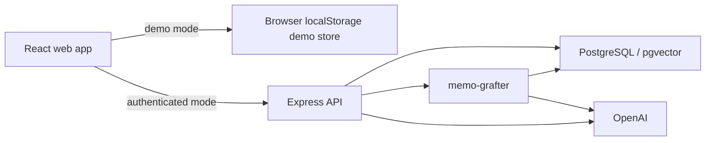
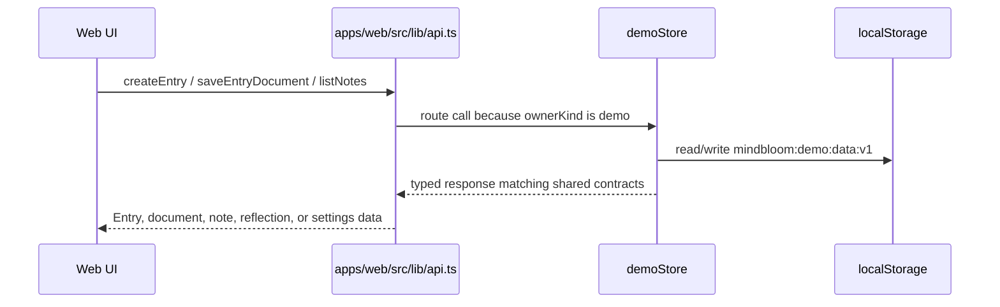
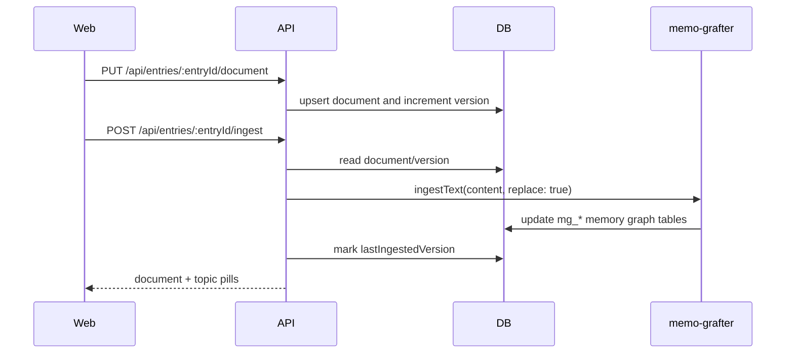

# MindBloom System Overview

This document is the onboarding map for the whole MindBloom codebase. Use the
team-specific docs for deeper ownership details, and use
`component-index.md` when you need to find a file quickly.

## Repository Shape

MindBloom is an npm workspace with three application packages:

| Path | Purpose |
| --- | --- |
| `apps/web` | React/Vite frontend. It owns the browser experience, demo-mode persistence, routing, visualizations, and API wrapper. |
| `apps/api` | Express API. It owns authenticated data, Postgres access, auth/session cookies, memory integration, and AI-backed workflows. |
| `packages/shared` | Shared TypeScript request, response, and domain types used by both the API and web app. |

The root `package.json` wires these workspaces together and exposes common
commands such as `npm run dev`, `npm run build`, `npm test`, `npm run typecheck`,
and `npm run check:boundaries`.

## Runtime Architecture

There are two user modes:

| Mode | Where data goes | Important code |
| --- | --- | --- |
| Demo | Browser `localStorage` only | `apps/web/src/lib/demoStore.ts`, `apps/web/src/lib/api.ts` |
| Authenticated | Express API and PostgreSQL | `apps/api/src/routes`, `apps/api/src/services`, `apps/api/src/repositories` |

The frontend API wrapper decides whether a call goes to the network or to the
demo store. Authentication state is observed in `AuthContext.tsx`, which calls
`setApiOwnerKind()` in `api.ts`.

## Main User Flows

### Demo Journal Flow

Demo mode intentionally avoids the authenticated API for entries, documents,
notes, reflections, and settings. It gives new users a real local experience
without requiring account setup.

### Authenticated Journal Save and Ingest

Document versioning matters. `lastIngestedVersion` prevents unchanged drafts
from being re-ingested. `replace: true` prevents one edited entry from creating
duplicate semantic sources.

### Bloom Message Flow

The web workspace saves or passes the current draft, then opens the entry
message streaming endpoint. The API stores the user message, builds context from
the saved document, selected text, tags, and brought-in graft labels, streams
the assistant response, stores the completed assistant message, and returns
updated topic pills.

### Reflection and Sharing Flow

Entry reflections are generated from the current entry, document, Bloom
messages, notes, topic pills, and graph snapshot. Share links are authenticated
only, select a subset of cards, and can expire or be revoked. Public share
reads are token-based and do not require login.

## Backend Layers

| Layer | Responsibility |
| --- | --- |
| `routes` | HTTP parsing, route params, Zod validation, status codes, SSE responses. |
| `schemas` | Reusable validation schemas for requests. |
| `services` | Business workflows, row mapping, owner-scoped operations. |
| `repositories` | Focused SQL access helpers. |
| `db` | Table definitions, DB initialization SQL, pool, transactions. |
| `memory` | Prompt building, AI parsing/fallbacks, graph normalization. |
| `memo-grafter` | Agent lifecycle, streaming adapter replacement, CLI config/schema references. |

Some responsibilities currently converge in `entries.service.ts`; developers
working there should be careful to preserve owner checks, response shapes, and
document version behavior.

## Shared Contracts

`packages/shared/src/index.ts` is the contract between web and API. It contains:

- Auth, settings, calendar, entries, documents, messages, notes, reflections,
  share links, graphs, recall, Bloom, and weekly reflection types.
- Session/date helpers such as `getSessionIdForDate()`, `getDateStamp()`,
  `getTodaySessionId()`, and `getReflectionSessionId()`.

Changes to shared types usually require coordinated updates in:

- API route response payloads.
- API services/repositories.
- Web `api.ts`.
- Demo store responses.
- Frontend components consuming those types.
- Tests on both sides.

## Data Ownership

MindBloom app tables are defined in `apps/api/src/db/schema.ts` and use the
`mindbloom_` prefix. Memo-grafter owns separate `mg_*` tables in the same
database. The API initializes MindBloom tables at startup, but memo-grafter
schema creation is explicit through `npm run memo:init` and
`npm run memo:migrate`.

## Environment Variables

| Variable | Used by | Purpose |
| --- | --- | --- |
| `DATABASE_URL` | API | PostgreSQL connection for MindBloom and memo-grafter runtime. |
| `OPENAI_API_KEY` | API | OpenAI chat/embedding calls. |
| `MEMO_GRAFTER_EMBEDDING_MODEL` | API/CLI | Optional memo-grafter embedding model override. |
| `API_PORT` | API | Local API port, default `4000`. |
| `PORT` | API | Hosting-provider port override. |
| `CORS_ORIGIN` | API | Allowed frontend origin. |
| `VITE_API_BASE_URL` | Web | API base URL used by browser fetch calls. |

## Deployment Shape

- Render hosts the Express API via `render.yaml`.
- Vercel serves the web build via `vercel.json`.
- Neon or another Postgres provider hosts the database with `pgvector`.
- Memo-grafter migrations must run against the target database before API
  traffic relies on memory graph operations.

