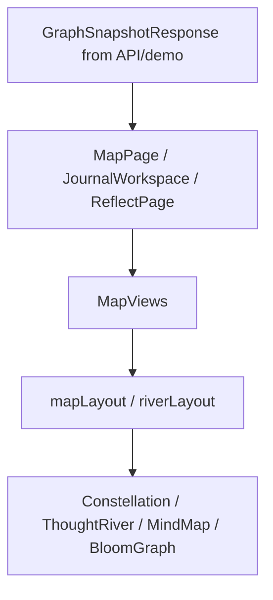

# Visual Systems, Map, and Reflection

This ownership area covers graph/map visualizations, reflection presentation,
Bloom visual cards, theme/style conventions, and visual layout helpers.

## Primary Files and Folders

| Path | Role |
| --- | --- |
| `apps/web/src/components/map` | Constellation, river, terrain, legend, toggle, and map detail components. |
| `apps/web/src/components/graph/MindMap.tsx` | Mind-map graph visualization. |
| `apps/web/src/components/bloom` | Bloom overlay, cards, and graph rendering. |
| `apps/web/src/pages/MapPage.tsx` | Full map page. |
| `apps/web/src/pages/ReflectPage.tsx` | Reflection page. |
| `apps/web/src/pages/PublicSharePage.tsx` | Public reflection share display. |
| `apps/web/src/lib/mapLayout.ts` | Constellation layout math. |
| `apps/web/src/lib/riverLayout.ts` | Thought river layout math. |
| `apps/web/src/lib/topicColors.ts` | Topic color ramps. |
| `apps/web/src/styles.css` | Global styling and visual tokens. |
| `packages/shared/src/index.ts` | Graph, memory, Bloom, and reflection types. |

## Data Flow

Visual components should consume shared graph shapes:

- `GraphNode`
- `GraphEdge`
- `GraphMemory`
- `MemoryEdge`
- `GraphSnapshotResponse`

They should not know about memo-grafter internals.

## Map Views

`MapViews.tsx` is the primary switchboard. It receives a snapshot and renders the
appropriate visual mode, usually by combining:

- `InsightConstellation`
- `ThoughtRiver`
- `DriftTerrain`
- supporting legends/toggles/detail panels

Keep new map modes behind this component when possible so page-level code stays
simple.

## Constellation

`InsightConstellation.tsx` renders graph nodes and edges as a spatial
constellation. It uses `computeConstellationLayout()` from `mapLayout.ts`.

`mapLayout.ts` responsibilities:

| Method | Purpose |
| --- | --- |
| `computeConstellationLayout()` | Calculates stable positions for nodes and edges based on graph data and available space. |

The layout helper is unit tested. If visual changes alter positioning behavior,
update tests deliberately.

## Thought River

`ThoughtRiver.tsx` renders nodes in a river-like progression. Supporting
components:

- `RiverCard.tsx`: individual node display and selected/dimmed states.
- `RiverConnector.tsx`: visual connection between river nodes.
- `RiverDetailPanel.tsx`: details for a selected node and related memory.
- `RiverMemoryDots.tsx`: compact markers for memories on a node.

`riverLayout.ts` responsibilities:

| Export | Purpose |
| --- | --- |
| `RIVER_CARD_HEIGHT` | Stable visual height used by river layout. |
| `buildRiverLayout()` | Computes card positions and connector geometry. |
| `directConnectionSelection()` | Selects direct connections for focused display. |

## Mind Map and Bloom Graph

`MindMap.tsx` renders graph-style themes and edges in a more direct mind-map
form. `BloomGraph.tsx` renders a Bloom-oriented graph inside Bloom visual
surfaces.

Both depend on normalized shared graph data. If graph contracts change, update
these components together with `graphNormalizer.ts` and shared types.

## Reflection Surfaces

`ReflectPage.tsx` owns reflection-oriented page presentation. It calls web API
helpers for reflection generation and displays the resulting insights/snapshot.

`PublicSharePage.tsx` reads a token from the route and calls
`getPublicReflectionShare(token)`. It renders only the selected cards returned
by the API.

Entry-level reflection rendering also appears inside `JournalWorkspace.tsx`; the
visual systems owner should coordinate with the journal team for card layout,
card types, and share selection UI.

## Bloom Visual Components

| Path | Purpose |
| --- | --- |
| `BloomOverlay.tsx` | Full overlay/presentation surface for Bloom output. |
| `BloomCard.tsx` | Card-level visual shell for Bloom insights. |
| `BloomGraph.tsx` | Graph rendering in Bloom context. |

These components use `BloomResponse`, `BloomInsights`, and graph snapshot types
from shared contracts.

## Topic Colors and Styling

`topicColors.ts` maps topic labels to color ramps and CSS classes. Important
exports:

- `getColorForTopic(label)`
- `colorClasses`
- `constellationRamps`

`styles.css` contains global styles and app-level visual tokens. When adding
visual states, prefer existing color systems and component patterns over
one-off classes.

## Shared Code Used

- Graph types from `@mindbloom/shared`.
- Reflection card types from `@mindbloom/shared`.
- `api.ts` methods such as `getSnapshot()`, `getEntrySnapshot()`,
  `generateReflection()`, and `getPublicReflectionShare()`.
- Layout helpers in `lib`.

## Things To Be Careful About

- Use stable dimensions for graph cards and controls so hover/selection states
  do not cause layout shifts.
- Keep rendering responsive for mobile and desktop.
- Avoid depending on raw memory-engine structures.
- If a visual requires new data, add it to shared contracts and API
  normalization first.
- Reflection card IDs are used by sharing; do not rename them casually.

